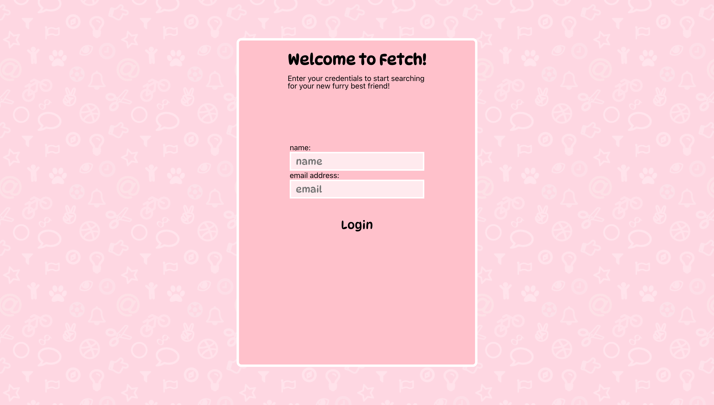
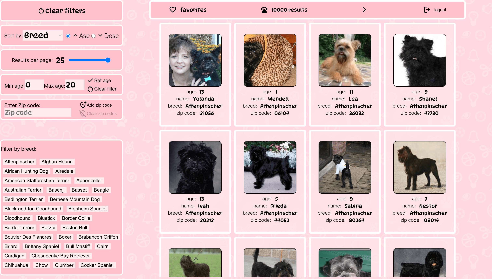
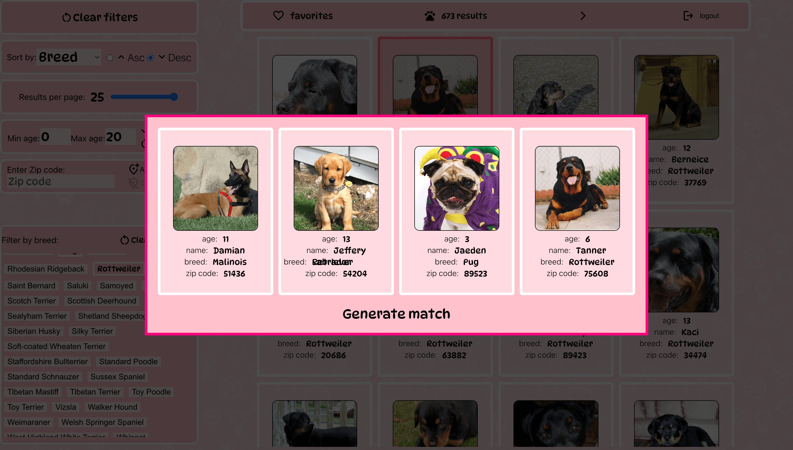
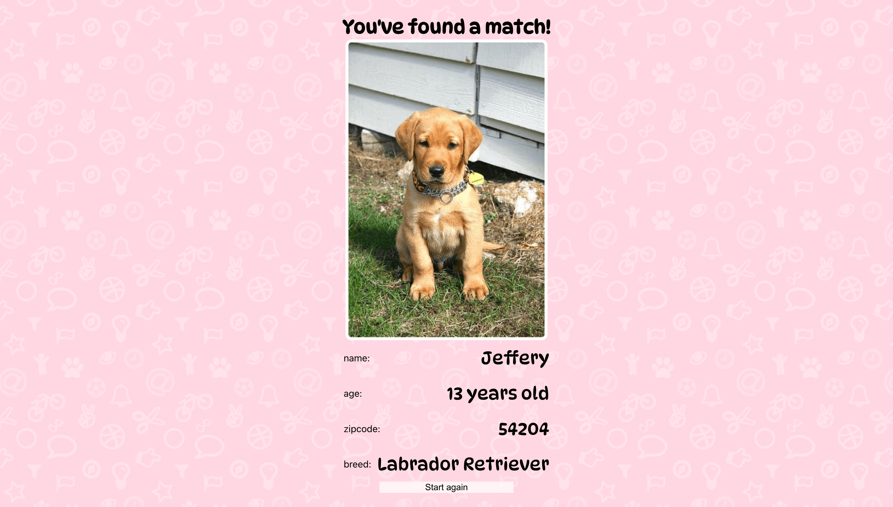

# Fetch

In this project, users will be able to search through a wide range of dogs fed by a server. Users will be able to filter through a number of filters such as their name, breed, age, and zipcode.\

You can access this project live [here](https://fetch-k6vq.onrender.com/login).

## Login screen

## Home screen

## Favorites modal

## Match screen

## To run this project locally

### `npm install`

Installs all the dependencies for the project.

### `npm start`

Runs the app in the development mode.\
Open [http://localhost:3000](http://localhost:3000) to view it in your browser.

You will also need to create an .env file in the root of your project and set the following envornment variable:

`REACT_APP_URL=http://localhost:3000`
